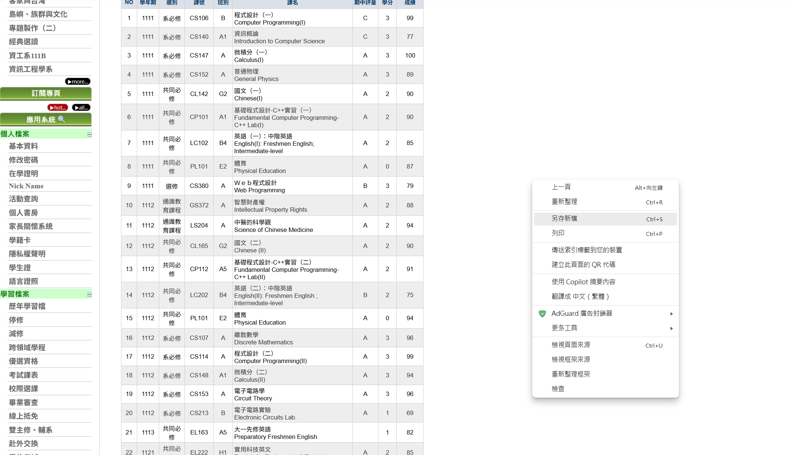
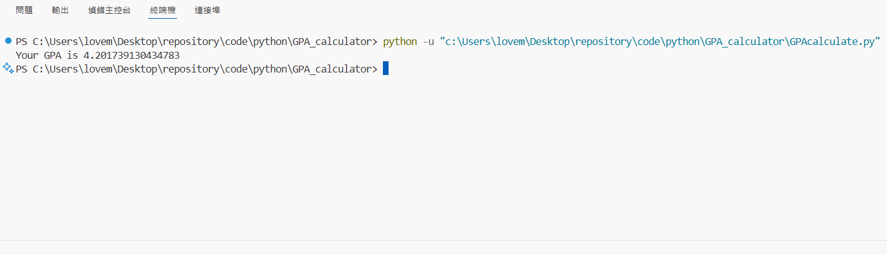

# 元智大學GPA估算 YZU GPA Calculator

由於portal沒有提供GPA，於是寫了一個程式來估算GPA

不過實際GPA請以英文成績單為主，程式為估計結果

## 操作

首先將整個專案放在一個資料夾中，可以在想要儲存的位置打開powershell輸入:

```
git clone "https://github.com/w39011651/YZU-GPA-Calculator.git"
```

保存專案

接著在元智大學portal > 成績 > 歷年成績查詢對網頁另存新檔



會有`IFrameRight.aspx.html`檔案以及`IFrameRight.aspx_files`資料夾

將這兩個檔案放專案資料夾中，這時候專案資料夾內會是以下結構:

```
|-- IFrameRight.aspx_files
    |---- 網頁資源等檔案
|-- IFrameRight.aspx.html
|-- .gitignore
|-- parser.py   #打印網頁資料程式
|-- GPAcalculate.py #主程式
|-- README.md
|-- image.png
|-- image-1.png
```

接著在專案資料夾中以powershell執行 `python GPAcalculate.py` 即可得到GPA



```
注: 學校英文成績單GPA採用4分制，更改成4分制後我的GPA是3.89，而程式估算的結果為3.886
```

## 環境

Python需要以下套件才可執行:
+ bs4
+ lxml
+ csv